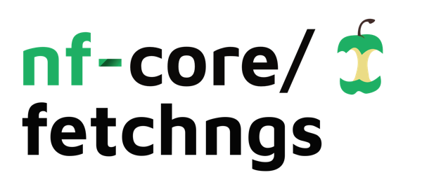
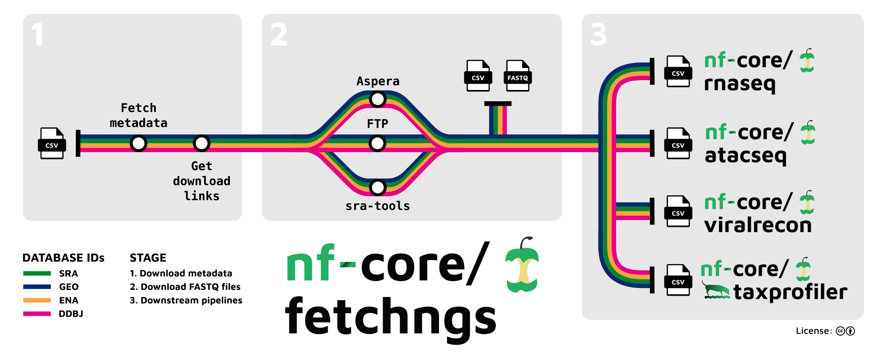

<h1>
  <picture>
    <source media="(prefers-color-scheme: dark)" srcset="docs/images/nf-core-fetchngs_logo_dark.png">
    
  </picture>
</h1>

[](https://github.com/nf-core/fetchngs/actions/workflows/ci.yml)
[](https://github.com/nf-core/fetchngs/actions/workflows/linting.yml)[](https://nf-co.re/fetchngs/results)[](https://doi.org/10.5281/zenodo.5070524)[](https://www.nf-test.com)

[](https://www.nextflow.io/)
[](https://docs.conda.io/en/latest/)
[](https://www.docker.com/)
[](https://sylabs.io/docs/)
[](https://tower.nf/launch?pipeline=https://github.com/nf-core/fetchngs)

[](https://nfcore.slack.com/channels/fetchngs)[](https://twitter.com/nf_core)[](https://mstdn.science/@nf_core)[](https://www.youtube.com/c/nf-core)

## Introduction

**nf-core/fetchngs** is a bioinformatics pipeline to fetch metadata and raw FastQ files from both public databases. At present, the pipeline supports SRA / ENA / DDBJ / GEO ids (see [usage docs](https://nf-co.re/fetchngs/usage#introduction)).



## Usage

> [!NOTE]
> If you are new to Nextflow and nf-core, please refer to [this page](https://nf-co.re/docs/usage/installation) on how to set-up Nextflow. Make sure to [test your setup](https://nf-co.re/docs/usage/introduction#how-to-run-a-pipeline) with `-profile test` before running the workflow on actual data.

First, prepare a samplesheet with your input data that looks as follows:

`ids.csv`:

```csv
SRR9984183
SRR13191702
ERR1160846
ERR1109373
DRR028935
DRR026872
```

Each line represents a database id. Please see next section for supported ids.

Now, you can run the pipeline using:

```bash
nextflow run nf-core/fetchngs \
   -profile <docker/singularity/.../institute> \
   --input ids.csv \
   --outdir <OUTDIR>
```

> [!WARNING]
> Please provide pipeline parameters via the CLI or Nextflow `-params-file` option. Custom config files including those provided by the `-c` Nextflow option can be used to provide any configuration _**except for parameters**_;
> see [docs](https://nf-co.re/usage/configuration#custom-configuration-files).

For more details and further functionality, please refer to the [usage documentation](https://nf-co.re/fetchngs/usage) and the [parameter documentation](https://nf-co.re/fetchngs/parameters).

## Supported ids

Via a single file of ids, provided one-per-line (see [example input file](https://raw.githubusercontent.com/nf-core/test-datasets/fetchngs/sra_ids_test.csv)) the pipeline performs the following steps:

### SRA / ENA / DDBJ / GEO ids

1. Resolve database ids back to appropriate experiment-level ids and to be compatible with the [ENA API](https://ena-docs.readthedocs.io/en/latest/retrieval/programmatic-access.html)
2. Fetch extensive id metadata via ENA API
3. Download FastQ files:
   - If direct download links are available from the ENA API:
     - Fetch in parallel via `wget` and perform `md5sum` check (`--download_method ftp`; default).
     - Fetch in parallel via `aspera-cli` and perform `md5sum` check. Use `--download_method aspera` to force this behaviour.
   - Otherwise use [`sra-tools`](https://github.com/ncbi/sra-tools) to download `.sra` files and convert them to FastQ. Use `--download_method sratools` to force this behaviour.
4. Collate id metadata and paths to FastQ files in a single samplesheet

## Pipeline output

The columns in the output samplesheet can be tailored to be accepted out-of-the-box by selected nf-core pipelines (see [usage docs](https://nf-co.re/fetchngs/usage#samplesheet-format)), these currently include:

- [nf-core/rnaseq](https://nf-co.re/rnaseq/usage#samplesheet-input)
- [nf-core/atacseq](https://nf-co.re/atacseq/usage#samplesheet-input)
- Ilumina processing mode of [nf-core/viralrecon](https://nf-co.re/viralrecon/usage#illumina-samplesheet-format)
- [nf-core/taxprofiler](https://nf-co.re/nf-core/taxprofiler)

To see the the results of a test run with a full size dataset refer to the [results](https://nf-co.re/fetchngs/results) tab on the nf-core website pipeline page.
For more details about the output files and reports, please refer to the
[output documentation](https://nf-co.re/fetchngs/output).

## Credits

nf-core/fetchngs was originally written by Harshil Patel ([@drpatelh](https://github.com/drpatelh)) from [Seqera Labs, Spain](https://seqera.io/) and Jose Espinosa-Carrasco ([@JoseEspinosa](https://github.com/JoseEspinosa)) from [The Comparative Bioinformatics Group](https://www.crg.eu/en/cedric_notredame) at [The Centre for Genomic Regulation, Spain](https://www.crg.eu/). Support for download of sequencing reads without FTP links via sra-tools was added by Moritz E. Beber ([@Midnighter](https://github.com/Midnighter)) from [Unseen Bio ApS, Denmark](https://unseenbio.com).

## Contributions and Support

If you would like to contribute to this pipeline, please see the [contributing guidelines](.github/CONTRIBUTING.md).

For further information or help, don't hesitate to get in touch on the [Slack `#fetchngs` channel](https://nfcore.slack.com/channels/fetchngs) (you can join with [this invite](https://nf-co.re/join/slack)).

## Citations

If you use nf-core/fetchngs for your analysis, please cite it using the following doi: [10.5281/zenodo.5070524](https://doi.org/10.5281/zenodo.5070524)

An extensive list of references for the tools used by the pipeline can be found in the [`CITATIONS.md`](CITATIONS.md) file.

You can cite the `nf-core` publication as follows:

> **The nf-core framework for community-curated bioinformatics pipelines.**
>
> Philip Ewels, Alexander Peltzer, Sven Fillinger, Harshil Patel, Johannes Alneberg, Andreas Wilm, Maxime Ulysse Garcia, Paolo Di Tommaso & Sven Nahnsen.
>
> _Nat Biotechnol._ 2020 Feb 13. doi: [10.1038/s41587-020-0439-x](https://dx.doi.org/10.1038/s41587-020-0439-x).
